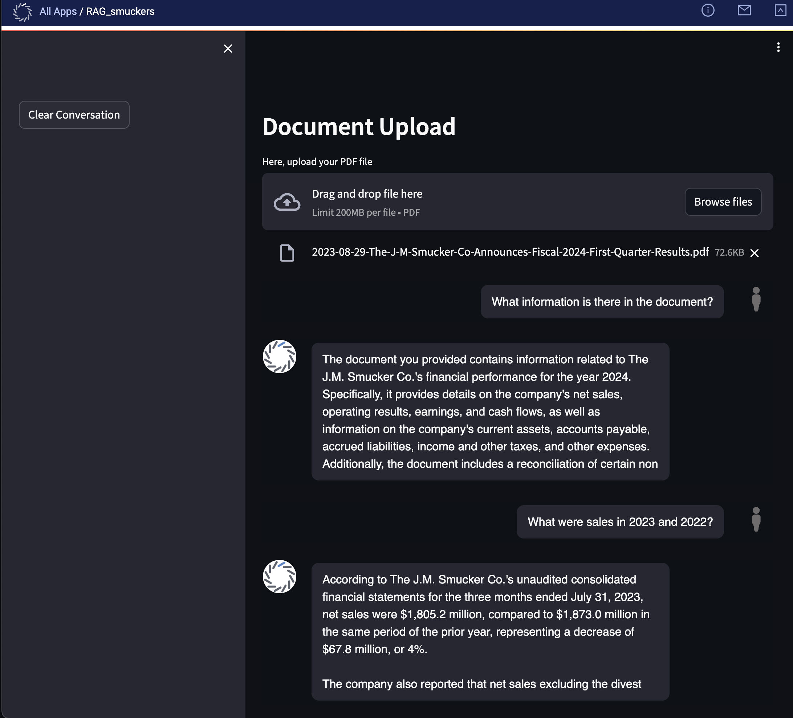

# LocalRAG




## Environment Setup

### Custom base image 
```nvcr.io/nvidia/pytorch:22.12-py3```


### Dockerfile instructions

```
RUN pip uninstall --yes mlflow
RUN pip uninstall --yes torch torchvision torchaudio protobuf
RUN pip install torch  --index-url https://download.pytorch.org/whl/cu118

RUN pip install "protobuf==3.20.3" langchain  transformers sentence-transformers \
                qdrant-client mlflow==2.8.0 getpass4 evaluate PyPDF2 tiktoken \
                textstat streamlit pypdf accelerate bitsandbytes
                
RUN pip install -q -U git+https://github.com/huggingface/peft.git

RUN pip uninstall --yes transformer-engine
RUN pip uninstall -y apex

RUN pip install -i https://test.pypi.org/simple/ streamlit-chat-domino
```


